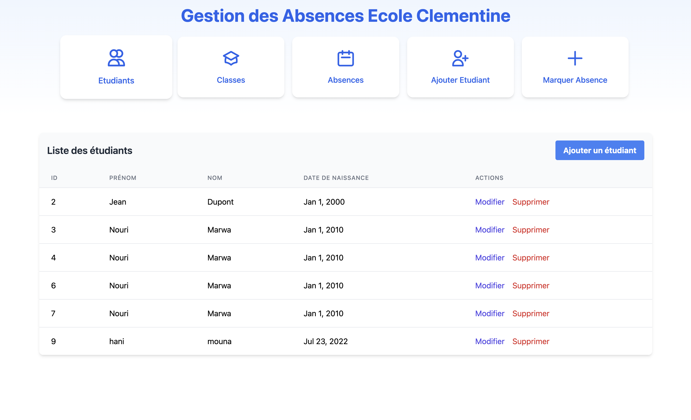
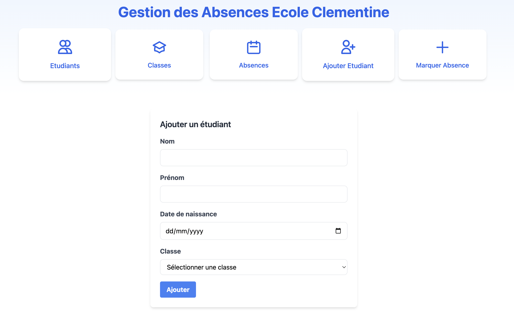
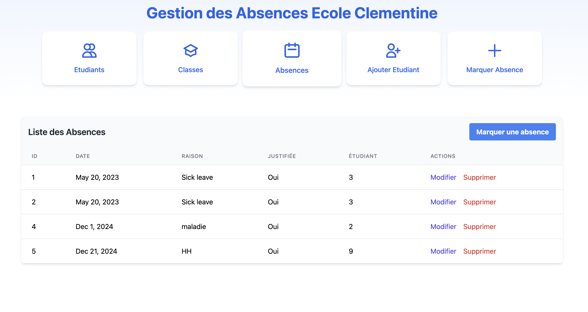
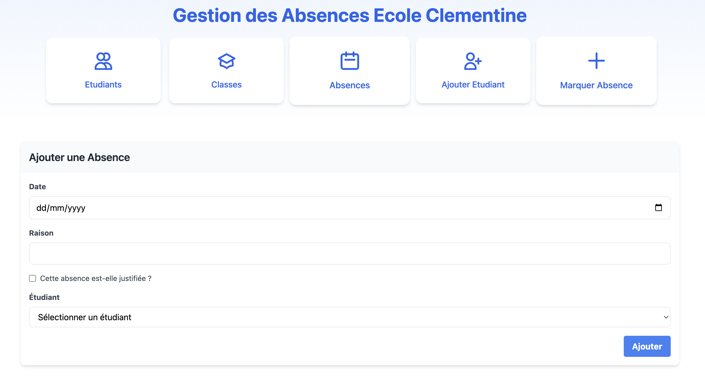

# Gestion des Absences - Application Spring & Angular

Ce projet est une application de gestion des absences pour école maternelle, développée avec Spring Boot pour le backend et Angular pour le frontend.

**Développé par : [zachary013](https://github.com/zachary013)**

## Aperçu du Projet

L'application permet la gestion complète d'une école maternelle avec les fonctionnalités suivantes :

- Gestion des absences
- Gestion des classes
- Gestion des eleves


### Gestion des etudiants




### Gestion des absences




## Architecture du Projet

Le projet suit une architecture en couches avec :

```
com.example.gestionabsences/
├── controller/
│   ├── AbsenceController
│   ├── ClasseController
│   └── EtudiantController
├── service/
│   ├── AbsenceService
    ├── AbsenceServiceImpl
│   ├── ClasseService
    ├── ClasseServiceImpl
│   ├── EtudiantService
│   └── EtudiantServiceImpl
├── dto/
│   ├── AbsenceDTO
│   ├── ClasseDTO
│   └── EtudiantDTO
└── entity/
    ├── Absence
    ├── Classe
    └── Etudiant
```

## Prérequis

- Java 17+
- Node.js 18+
- Maven 3.8+
- MySQL

## Installation

1. Cloner le projet :
```bash
git clone [url-du-projet]
```

2. Backend (Spring Boot) :
```bash
cd gestion-absences
mvn clean install
```

3. Frontend (Angular) :
```bash
cd gestion-absences-ui
npm install
```

## Démarrage

1. Lancer le backend :
```bash
cd gestion-absences
mvn spring-boot:run
```

2. Lancer le frontend :
```bash
cd gestion-absences-ui
ng serve
```

L'application sera accessible à l'adresse : `http://localhost:4200`

## Fonctionnalités Principales

- **Gestion des Élèves**
    - Inscription des nouveaux élèves
    - Suivi des informations personnelles
    - Historique des absences

- **Gestion des Classes**
    - Création et modification des classes
    - Attribution des élèves aux classes
    - Gestion des effectifs

- **Suivi des Absences**
    - Enregistrement des absences quotidiennes
    - Justification des absences
    - Génération de rapports

## Technologies Utilisées

### Backend
- Spring Boot
- Spring Data JPA
- Maven
- MySQL

### Frontend
- Angular 15+
- Angular Material
- TypeScript
- TailwindCSS
- SCSS

## Contribution

1. Forker le projet
2. Créer une branche (`git checkout -b feature/nouvelle-fonctionnalite`)
3. Commiter les changements (`git commit -m 'Ajout d'une nouvelle fonctionnalité'`)
4. Pusher vers la branche (`git push origin feature/nouvelle-fonctionnalite`)
5. Ouvrir une Pull Request

## Licence

Ce projet est sous licence MIT. Voir le fichier `LICENSE` pour plus de détails.

## Contact

zachary013 - [GitHub Profile](https://github.com/zachary013)